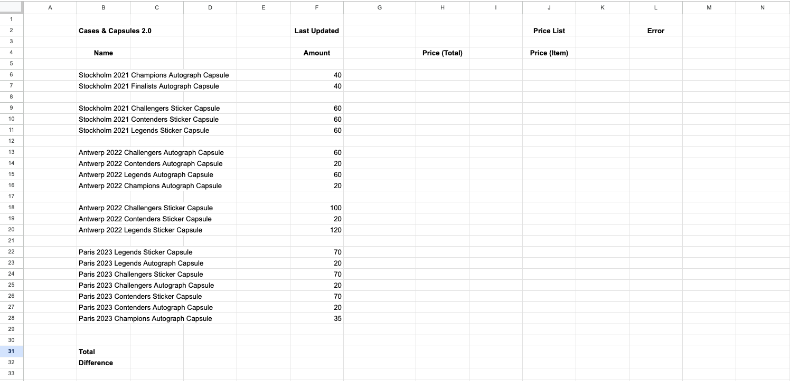

# SteamQuery v2 by devusSs


## Disclaimer

I do not own any of the rights on potential items / skins / pictures / names used in or outside of this program. Every right goes to their respective owner.<br/>
If there is any issues involving copyright, ownership or any related issues (for example the Steam TOS) please contact the owner (devusSs) via [e-mail](mailto:devuscs@gmail.com) or [open an issue here](https://github.com/devusSs/steamquery-v2/issues).<br/>

<b>Please do not use this program if you are unsure about what it does or how you should use it. Please never share your Steam API key with anyone (including the author of this program).</b>

## Why is this program called SteamQuery v2 and how do I use it?

There used to be a version one of this pogram. That program however had a lot of perhaps unfixable bugs due to the structure of the code.<br/>
Therefor a new version of this program was created focussing on performance and clean code as well as usability.<br/>

This program makes it possible for you to keep track of certain [CSGO](https://www.counter-strike.net/) skins and items in your [Steam](https://steamcommunity.com/) inventory.<br/>
To do that you will need to create a gcloud.json config file on the Google developer page as well as adding the created service account to your editors on the Google sheet.<br/>
You will also need to create a [config file](./files/config.json) for the program to use.<br/>

Please make sure you set up your Google sheet properly as well.<br/>
The empty lines between the item names and corresponding price cells etc. do not matter, the program will ignore them. It simply serves visibility for the user.<br/>

### How to setup your Google sheet to work properly:


For that example you would set following variables in your config:

```json
{
  "item_list": {
    "column_letter": "B",
    "start_number": 6,
    "end_number": 28
  },
  "price_column": "J",
  "price_total_column": "H",
  "amount_column": "F",
  "org_cells": {
    "last_updated_cell": "G2",
    "total_value_cell": "F31",
    "error_cell": "M2",
    "difference_cell": "F32"
  },
  "spread_sheet_id": "your spreadsheet id from the URL",
  "steam_api_key": "your api key"
}
```

To run the program simple execute:

```bash
steamquery-v2
```

This will start the program with default flags. Considering you setup the configs using this guide everything will work fine.<br/>
If you ever need more configuration options simply set them via flags:

```
-l  to set the logging directory
-c  to set the config file path
-g  to set the gcloud config file path
-d  to run the app in debug mode (not needed, simply adds logging overhead)
-du to disable update checks
-v  to print build information
-a  to run the app in analysis mode (checks for potential errors)
```

## Why does this program need my Steam API key?

This program queries the status of the Steam Sessions Logon and the Steam Community Status for CSGO to check if everything is up and working before running queries against the endpoints.<br/>
These API routes are protected and need a valid Steam API key to work.<br/>
Get your's [here](https://steamcommunity.com/dev/apikey).

## Why do I need to count the amounts manually?

While it is technically prossible to query the Steam inventories via the official API and count the items programmatically, it is not possible to look into storage units which many people use to store their cases and capsules.<br/>
As long as that is not possible you will need to count your items manually.

## Problem Solving

You may run the program in analysis mode to check for potential problems.<br/>
To do that execute:

```bash
steamquery-v2 -c "your config path" -g "your gcloud config path" -a -du
```

If that does not help you may open an issue.

## Building and running the app

Either download an already compiled program from the [releases](https://github.com/devusSs/steamquery-v2/releases) section or clone the repository and compile the program yourself. You will need the [Go(lang)](https://go.dev) binaries for that. Use the `Makefile` for more information.

Errors will usually be self-explanatory. Any weird errors may require the use of [Google](https://google.com) or [creating an issue](https://github.com/devusSs/steamquery-v2/issues) on Github.

## Further features (soonTM)

- automatically query items from Steam inventories
- automatically check for already added items and compare them to queried items from above
